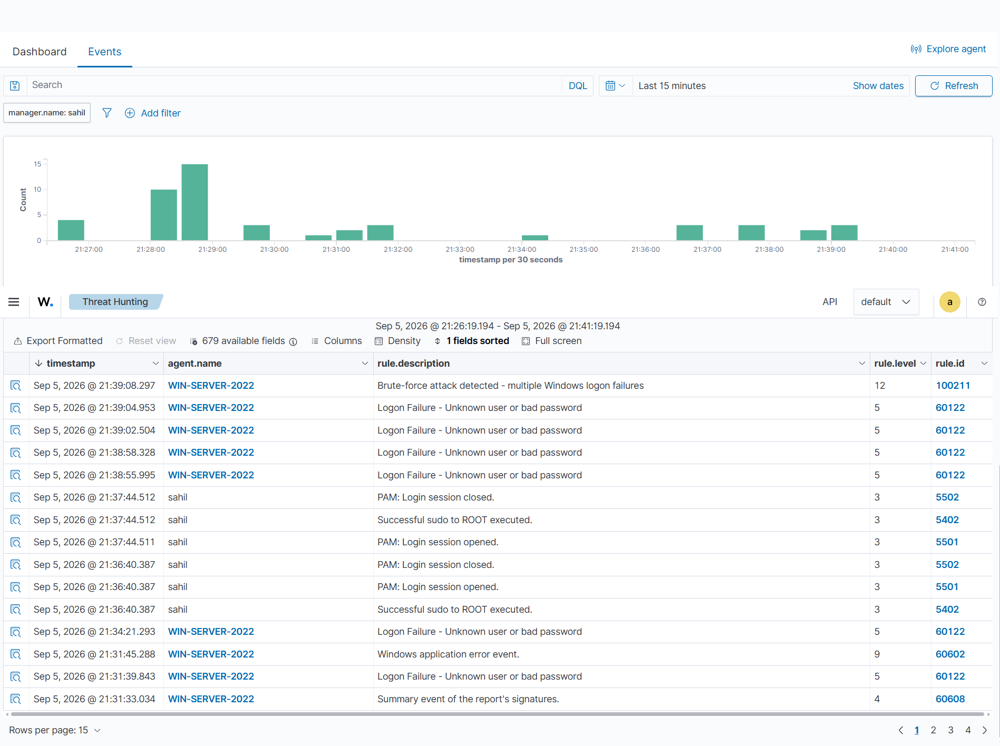

# Detection Rules

[](https://github.com/sahilnikam2410/detection-rules/actions/workflows/validate.yml)


Detection-as-code from my SOC lab work: Wazuh rules, the same logic in Sigma,
and the Splunk queries Sigma compiles to. Every rule is labelled with what
actually happened to it. **Validated** means it fired during a controlled run
and the evidence is in this repo. **Draft** means it's written and loads, but
has never been observed firing.

## Rules

| ATT&CK | Detection | Wazuh | Sigma | Status |
|---|---|---|---|---|
| [T1110](https://attack.mitre.org/techniques/T1110/) | 5+ Windows logon failures from one source in 60s | [`100211`](wazuh/validated/100211_windows_bruteforce.xml) | [`win_bruteforce_single_source`](sigma/windows/win_bruteforce_t1110.yml) | ✅ **validated** 2026-09-05 · [evidence](evidence/bruteforce-100211.png) |
| [T1110](https://attack.mitre.org/techniques/T1110/) → [T1078](https://attack.mitre.org/techniques/T1078/) | Brute-force burst, then a successful logon from the same source | [`100220-100222`](wazuh/drafts/100220-100222_bruteforce_chain.xml) | [`win_bruteforce_then_success`](sigma/windows/win_bruteforce_t1110.yml) | 📝 draft |

## Evidence: rule 100211 firing



Four `60122` failures between 21:38:55 and 21:39:04, then `100211` at level 12
at 21:39:08. The isolated failures at 21:31:39 and 21:34:21 raised nothing.
That half matters just as much: a correlation rule is only worth having if it
stays quiet on noise.

## Layout

```
wazuh/
  validated/   rules that fired in a controlled run, with evidence
  drafts/      rules that load but have not been observed firing
sigma/         Sigma v2 rules + correlations (portable logic)
queries/
  splunk/      SPL compiled from sigma/ by CI; do not hand-edit
tests/         step-by-step test procedure per technique, with a result log
evidence/      captures from validation runs
```

## How a rule gets to "validated"

1. Map the technique to ATT&CK and write down the telemetry it should produce.
2. Prove ingestion: one known event must reach the SIEM before any test counts.
3. Run the [test procedure](tests/T1110_bruteforce.md): noise must stay quiet, the burst must fire, spread-out sources must not.
4. Capture the alert, commit the evidence, move the rule from `drafts/` to `validated/`.

## CI

Every push runs [`validate.yml`](.github/workflows/validate.yml):

- **Sigma:** `sigma check --fail-on-issues`, then compile to Splunk SPL and fail if `queries/splunk/` is out of date.
- **Wazuh:** XML well-formedness, unique rule ids across all files, then all rules loaded into a real `wazuh-manager` container and checked with `wazuh-analysisd -t`.

## Deploy

**Wazuh:** append the rule to `/var/ossec/etc/rules/local_rules.xml` on the manager, then:

```bash
sudo /var/ossec/bin/wazuh-analysisd -t && sudo systemctl restart wazuh-manager
```

**Splunk:** paste the query from [`queries/splunk/`](queries/splunk/) as a saved search/alert.

**Sigma, other backends:**

```bash
pip install sigma-cli pysigma-backend-splunk
sigma convert -t splunk -p splunk_windows sigma/windows/win_bruteforce_t1110.yml
```

## Tuning notes

- **`same_source_ip` / `group-by: IpAddress` is load-bearing.** Without it, five failures from five different hosts also fire. That's a different detection with a much worse false-positive rate.
- **Frequency and timeframe** on `100211` come from lab notes, not the capture. Tune them against your own baseline.
- **Known false positives:** service accounts with stale cached credentials, and password managers retrying after a password change.

## Scope

All testing happens on hosts I own, in an isolated lab with no route to the internet or third-party systems.

---

Part of my SOC portfolio: **[hackwithsahil.vercel.app](https://hackwithsahil.vercel.app)** · lab write-up in **[silent-operator](https://github.com/sahilnikam2410/silent-operator)**
